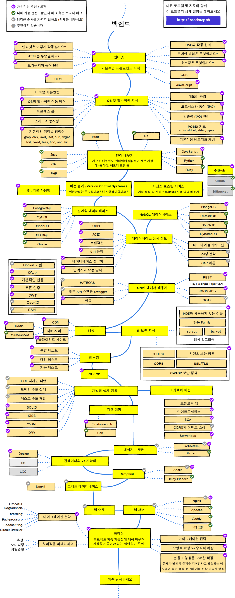

블로그를 작성하게 된 계기는 < 2020 백엔드 개발자 로드맵 >을 우연히 본 것이다. 
이미 많은 사람들이 알고 있고 따라가고 있는 로드맵이라 무턱대고 시작했다. 
시작해보니 내용을 찾기도 힘들고, 막상 힘들게 찾아 이해하여도 돌아서면 까먹는터라 기록이 필요할 것 같아서 블로그에 남기기로 했다. 

{: width="80%" height="80%"}

로드맵을 보니, 모두 해야하나 싶고 아주 막막하지 않나? 그런데 누군가 그러더라. 
> 다 해낼 자신 없으면 포기해라. 다른 길을 선택하는 것이 더 옳다.

내가 가진 장점이라고는 남들보다 좀 더 열심히 하는 거니까 포기하지 않고 끝까지 시작해보려 한다.
얼마나 완벽하게 해낼 수 있을지 모르겠지만, 반드시 성장은 할테니까!

나름 학교에서 다른 공학을 배우던 것 보다 훨씬 재밌다.